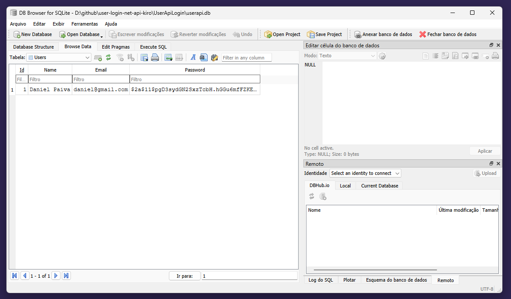

# UserApiLogin

REST API para gerenciamento de usuários construída com **.NET 10**, padrão MVC, persistência via **Entity Framework Core + SQLite** e autenticação **JWT Bearer**.

---

## Tecnologias

| Pacote                                                          | Versão |
| --------------------------------------------------------------- | ------ |
| .NET                                                            | 10.0   |
| Microsoft.EntityFrameworkCore.Sqlite                            | 10.0.7 |
| Microsoft.EntityFrameworkCore.Design                            | 10.0.7 |
| Microsoft.Extensions.Diagnostics.HealthChecks.EntityFrameworkCore | 10.0.7 |
| Microsoft.AspNetCore.Authentication.JwtBearer                   | 10.0.7 |
| BCrypt.Net-Next                                                 | 4.2.0  |
| Swashbuckle.AspNetCore                                          | 6.9.0  |

---

## Funcionalidades

- **CRUD de usuários** com senhas armazenadas como hash BCrypt
- **Autenticação JWT** — token exigido na rota de exclusão
- **Paginação** no `GET /api/users` com metadados de navegação
- **Cache em memória** com invalidação automática nas operações de escrita
- **Rate limiting** nativo do ASP.NET — 5 req/min no login, 60 req/min nas demais rotas
- **Health checks** com verificação do banco de dados
- **Logs estruturados** com `ILogger` e message templates

---

## Estrutura do Projeto

```
UserApiLogin/
├── Controllers/
│   ├── AuthController.cs      # Login e geração de token JWT
│   └── UsersController.cs     # CRUD de usuários com cache e paginação
├── Data/
│   └── AppDbContext.cs        # Contexto do Entity Framework
├── DTOs/
│   ├── LoginDto.cs            # Payload de autenticação
│   ├── PagedResultDto.cs      # Envelope de resposta paginada
│   ├── RegisterDto.cs         # Payload de criação/atualização
│   └── UserDto.cs             # Resposta pública (sem senha)
├── Migrations/                # Migrations geradas pelo EF Core
├── Models/
│   └── User.cs                # Modelo de domínio
├── Services/
│   └── TokenService.cs        # Geração de tokens JWT
├── appsettings.json           # Configuração de produção
├── appsettings.Development.json
└── Program.cs

UserApiLogin.Tests/
├── Controllers/
│   ├── AuthControllerTests.cs
│   └── UsersControllerTests.cs
├── Helpers/
│   └── DbContextHelper.cs     # AppDbContext em memória para testes
└── Services/
    └── TokenServiceTests.cs
```

---

## Modelo de Dados

```csharp
public class User
{
    public int    Id       { get; set; }
    public string Name     { get; set; }
    public string Email    { get; set; }  // único
    public string Password { get; set; }  // hash BCrypt
}
```

A senha nunca é exposta nas respostas — todos os endpoints retornam `UserDto` (Id, Name, Email).

---

## Pré-requisitos

- [.NET 10 SDK](https://dotnet.microsoft.com/download/dotnet/10.0)
- Ferramenta EF Core CLI (opcional, para gerenciar migrations manualmente):

```bash
dotnet tool install --global dotnet-ef
```

---

## Configuração

As configurações ficam em `appsettings.json`. Em produção, substitua os valores sensíveis por variáveis de ambiente ou um gerenciador de segredos.

```json
{
  "ConnectionStrings": {
    "DefaultConnection": "Data Source=userapi.db"
  },
  "JwtSettings": {
    "SecretKey": "TROQUE_ESTA_CHAVE_EM_PRODUCAO",
    "Issuer": "UserApiLogin",
    "Audience": "UserApiLoginClients",
    "ExpiresInMinutes": "60"
  },
  "Logging": {
    "LogLevel": {
      "Default": "Information",
      "Microsoft.AspNetCore": "Warning",
      "Microsoft.EntityFrameworkCore": "Warning",
      "UserApiLogin": "Information"
    }
  }
}
```

> **Atenção:** nunca versione a `SecretKey` real em repositórios públicos.

Em desenvolvimento (`appsettings.Development.json`) o nível de log é `Debug`, incluindo as queries SQL do EF Core.

---

## Executando a API

```bash
cd UserApiLogin
dotnet run
```

O banco SQLite (`userapi.db`) é criado e as migrations são aplicadas automaticamente na primeira execução.

URLs padrão:

| Perfil | URL                    |
| ------ | ---------------------- |
| HTTP   | http://localhost:5077  |
| HTTPS  | https://localhost:7253 |

Swagger UI disponível em:

```
http://localhost:5077/swagger
```

---

## Executando os Testes

```bash
cd UserApiLogin.Tests
dotnet test
```

Os testes usam EF Core InMemory e `NullLogger`, sem dependência de banco ou infraestrutura externa. São 29 testes cobrindo controllers e serviços.

---

## Endpoints

### Auth

| Método | Rota              | Auth | Rate limit   | Descrição                        |
| ------ | ----------------- | ---- | ------------ | -------------------------------- |
| `POST` | `/api/auth/login` | Não  | 5 req/min    | Autentica e retorna um token JWT |

**Body**
```json
{
  "email": "joao@email.com",
  "password": "senha123"
}
```

**Resposta 200**
```json
{
  "token": "<jwt>",
  "user": {
    "id": 1,
    "name": "João Silva",
    "email": "joao@email.com"
  }
}
```

---

### Users

| Método   | Rota              | Auth                | Rate limit   | Descrição                     |
| -------- | ----------------- | ------------------- | ------------ | ----------------------------- |
| `GET`    | `/api/users`      | Não                 | 60 req/min   | Lista usuários paginados      |
| `GET`    | `/api/users/{id}` | Não                 | 60 req/min   | Retorna um usuário pelo Id    |
| `POST`   | `/api/users`      | Não                 | 60 req/min   | Cria um novo usuário          |
| `PUT`    | `/api/users/{id}` | Não                 | 60 req/min   | Atualiza um usuário existente |
| `DELETE` | `/api/users/{id}` | **JWT obrigatório** | 60 req/min   | Remove um usuário             |

#### Paginação — GET /api/users

Aceita os query params `page` (padrão: `1`) e `pageSize` (padrão: `10`, máximo: `50`).

```
GET /api/users?page=2&pageSize=5
```

**Resposta 200**
```json
{
  "page": 2,
  "pageSize": 5,
  "totalItems": 42,
  "totalPages": 9,
  "hasPreviousPage": true,
  "hasNextPage": true,
  "items": [
    { "id": 6, "name": "...", "email": "..." }
  ]
}
```

#### Body — POST /api/users e PUT /api/users/{id}

```json
{
  "name": "João Silva",
  "email": "joao@email.com",
  "password": "senha123"
}
```

**Resposta 201 (criação)**
```json
{
  "id": 1,
  "name": "João Silva",
  "email": "joao@email.com"
}
```

---

### Health Checks

| Rota             | Descrição                                          |
| ---------------- | -------------------------------------------------- |
| `GET /health`    | Retorna `Healthy` / `Unhealthy` (texto simples)    |
| `GET /health/ready` | Retorna JSON com status detalhado do banco      |

**Resposta 200 — GET /health/ready**
```json
{
  "status": "Healthy",
  "checks": [
    {
      "name": "database",
      "status": "Healthy",
      "duration": "3.21ms"
    }
  ]
}
```

Se o banco estiver inacessível, o endpoint retorna `503 Unhealthy`.

---

## Autenticação JWT

O endpoint `DELETE /api/users/{id}` exige um token JWT válido no header `Authorization`.

### Fluxo

1. Crie um usuário via `POST /api/users`.
2. Autentique via `POST /api/auth/login` e copie o `token` retornado.
3. Inclua o token nas requisições protegidas:

```
Authorization: Bearer <token>
```

### Via Swagger UI

1. Acesse `/swagger`.
2. Clique em **Authorize** (ícone de cadeado).
3. Informe `Bearer <token>` e confirme.
4. Execute o endpoint `DELETE`.

---

## Cache

Os endpoints `GET /api/users` e `GET /api/users/{id}` utilizam `IMemoryCache` com TTL de 2 minutos.

A invalidação é automática:

| Operação | Invalida                          |
| -------- | --------------------------------- |
| `POST`   | Toda a listagem paginada          |
| `PUT`    | Entrada do usuário + listagem     |
| `DELETE` | Entrada do usuário + listagem     |

A listagem usa um número de versão como parte da chave de cache, evitando a necessidade de enumerar e remover entradas individualmente.

---

## Rate Limiting

Implementado com o middleware nativo `Microsoft.AspNetCore.RateLimiting` (sem pacote externo). O limite é por IP, com janela fixa de 1 minuto.

| Política   | Aplicada em        | Limite       |
| ---------- | ------------------ | ------------ |
| `auth`     | `AuthController`   | 5 req/min    |
| `general`  | `UsersController`  | 60 req/min   |

Quando o limite é atingido, a API retorna `429 Too Many Requests`.

---

## Logs

Os logs seguem o padrão de **message templates estruturados**, compatíveis com providers como Seq, Application Insights e OpenTelemetry.

Eventos registrados:

| Evento                        | Nível       | Controller      |
| ----------------------------- | ----------- | --------------- |
| Tentativa de login            | Information | Auth            |
| Login bem-sucedido            | Information | Auth            |
| Credenciais inválidas         | Warning     | Auth            |
| Criação de usuário            | Information | Users           |
| Atualização de usuário        | Information | Users           |
| Remoção de usuário            | Information | Users           |
| Email duplicado               | Warning     | Users           |
| Usuário não encontrado        | Warning     | Users           |
| Parâmetros de paginação ruins | Warning     | Users           |
| Cache hit / miss              | Debug       | Users           |
| Migrations na inicialização   | Information | Program         |

---

## Migrations

As migrations são aplicadas automaticamente ao iniciar a aplicação. Para gerenciá-las manualmente:

```bash
# Criar nova migration
dotnet ef migrations add NomeDaMigration

# Aplicar migrations pendentes
dotnet ef database update

# Reverter última migration
dotnet ef migrations remove
```

---

## Códigos de Resposta

| Código             | Significado                          |
| ------------------ | ------------------------------------ |
| `200 OK`           | Requisição bem-sucedida              |
| `201 Created`      | Recurso criado com sucesso           |
| `204 No Content`   | Recurso removido com sucesso         |
| `400 Bad Request`  | Parâmetros de entrada inválidos      |
| `401 Unauthorized` | Token ausente ou inválido            |
| `404 Not Found`    | Recurso não encontrado               |
| `409 Conflict`     | Email já cadastrado ou em uso        |
| `429 Too Many Requests` | Limite de requisições atingido  |
| `503 Service Unavailable` | Banco inacessível (health check) |

---

## Banco de Dados

Abaixo um exemplo do banco SQLite populado com registros de usuários:



---

## Licença

Distribuído sob a licença [MIT](LICENSE).
